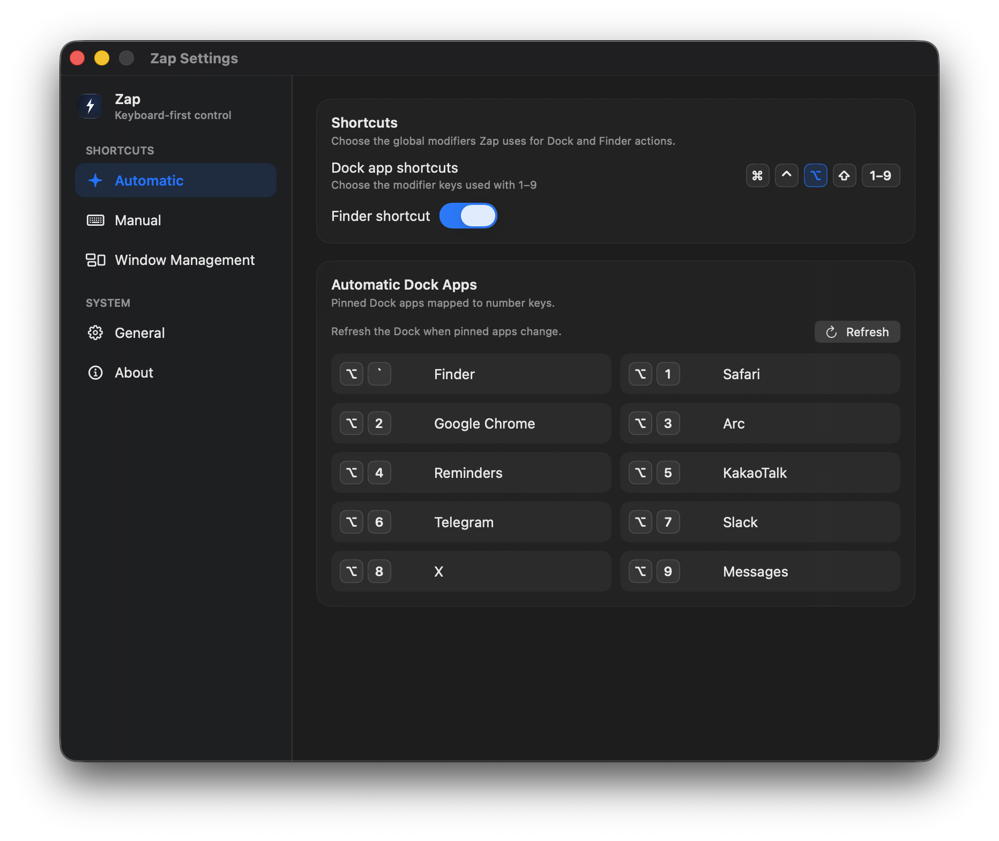
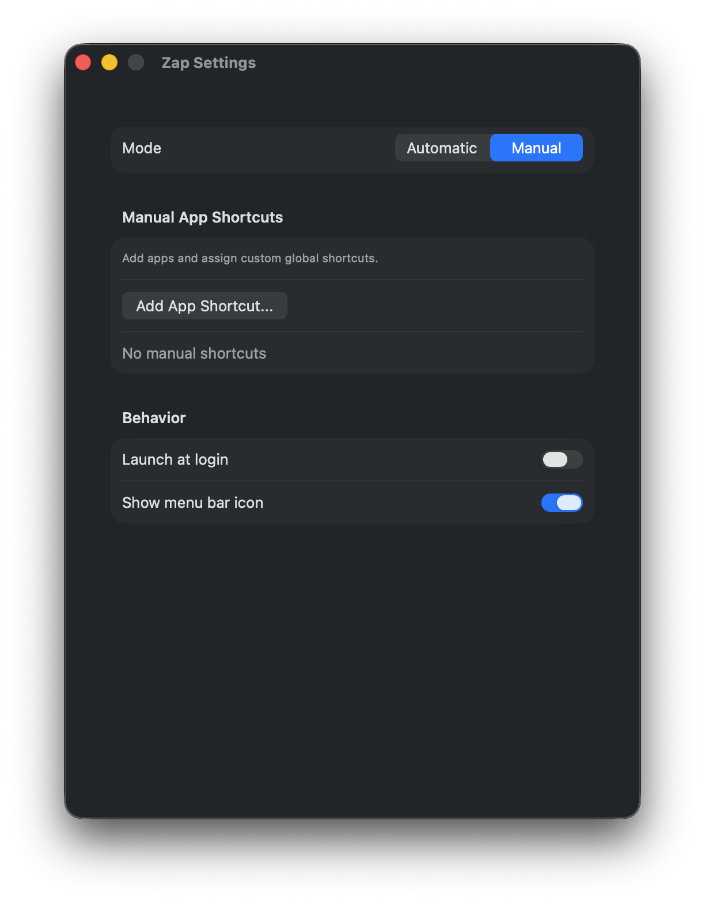
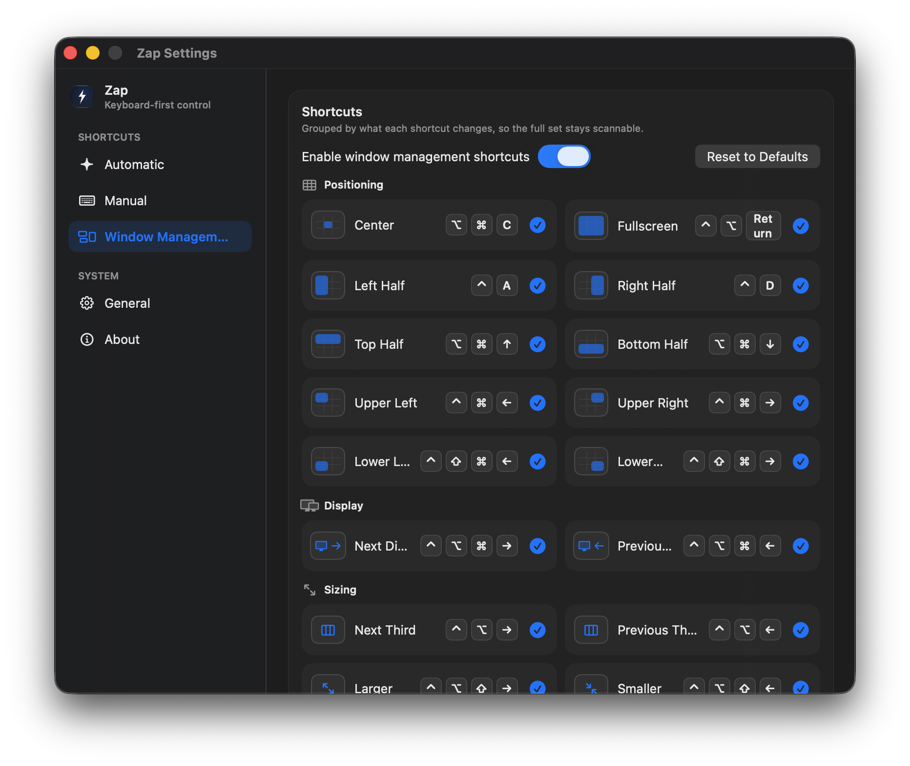

# Zap

Zap is a native macOS utility for opening apps, switching to them, and managing windows with global keyboard shortcuts.

It is built for people who keep their most-used apps in the Dock, prefer custom app shortcuts, and want keyboard-first window control. Zap can automatically map Dock apps to number shortcuts, register manual app shortcuts, and move or resize the frontmost window without reaching for the mouse.

## Screenshots

  
  

  

## Recent updates

- Added Window Management shortcuts for centering, fullscreen, halves, corners, thirds, resizing, display movement, undo, and redo.
- Reworked Settings into a sidebar with Automatic, Manual, Window Management, General, and About pages.
- Updated the menu bar experience with native Quick Launch and Window Control menus.

## What Zap does

Zap combines app launching and window control.

### Automatic Dock shortcuts

Automatic mode reads the apps pinned to your macOS Dock and maps the first nine apps to number keys.

For example, if the Dock shortcut modifier is set to `⌥`:

- `⌥1` opens or focuses the first pinned Dock app.
- `⌥2` opens or focuses the second pinned Dock app.
- The mapping continues through `⌥9`.

You can choose the modifier keys used with the number shortcuts from Settings. Zap supports `⌘`, `⌃`, `⌥`, and `⇧` combinations.

### Manual app shortcuts

Manual mode lets you add apps directly and assign custom global shortcuts to them.

This is useful when:

- an app is not pinned to your Dock;
- you want a more memorable shortcut for a specific app;
- you want a shortcut that is separate from the automatic Dock order.

Manual shortcuts can be enabled, disabled, re-recorded, or removed at any time.

### Window Management shortcuts

Window Management moves and resizes the frontmost window with customizable global shortcuts. The default set includes:

- `⌥⌘C` to center the active window;
- `⌥⌘F` to make it fullscreen;
- `⌥⌘←`, `⌥⌘→`, `⌥⌘↑`, and `⌥⌘↓` for half-screen layouts;
- corner placement shortcuts;
- previous and next display shortcuts;
- previous and next third shortcuts;
- larger and smaller resize shortcuts;
- undo and redo for window layout changes.

Window Management requires macOS Accessibility permission so Zap can move and resize other apps' windows. If permission has not been granted yet, Zap shows the permission state in Settings and locks the window shortcuts until access is available.

### Finder shortcut

Zap includes an optional Finder shortcut. When enabled, `⌥` plus the physical `₩` / `` ` `` key opens Finder using behavior similar to clicking Finder in the Dock.

The displayed key follows your current input source:

- English input source: `` ` ``
- Korean input source: `₩`

The shortcut is based on the physical key, so it continues to work across Korean and English input states.

## Menu bar and Dock behavior

By default, Zap runs as a menu bar app.

The native menu bar menu includes:

- Quick Launch for Finder, manual app shortcuts, and Dock number shortcuts;
- Window Control for Window Management actions;
- Refresh Dock Apps;
- Check for Updates;
- Settings;
- Quit.

If you hide the menu bar icon, Zap switches to a regular Dock app so Settings is still reachable. Clicking the Dock icon opens the Settings window.

## Settings

Zap Settings is organized into sidebar pages.

### Automatic

Use Automatic to configure Dock app number shortcuts, enable or disable the Finder shortcut, refresh the Dock app list, and review the current Dock app mapping.

### Manual

Use Manual to add app shortcuts, record custom shortcuts, enable or disable shortcuts, and remove shortcuts you no longer need.

### Window Management

Use Window Management to enable or disable window shortcuts, review shortcuts by category, record custom shortcuts for each action, reset shortcuts to their defaults, and check Accessibility permission status.

### General

Use General to request Accessibility permission, enable or disable launch at login, show or hide the menu bar icon, and check for updates.

### About

Use About to view the current app version, build number, and creator link.

Automatic, Manual, and Window Management shortcuts can be used together. If a shortcut conflicts with another registered shortcut, Zap shows a registration error.

## Privacy and permissions

Zap runs locally on your Mac.

It does not use a server, does not collect analytics, and does not send your app list, window information, or shortcut settings anywhere. App and shortcut settings are stored locally with `UserDefaults`.

Window Management uses macOS Accessibility APIs to move and resize other apps' windows. Granting Accessibility permission only enables local window-control behavior for Zap; it does not change Zap's data collection behavior.

## Notes

- Requires macOS 13 or later.
- Dock shortcuts depend on the current pinned Dock app order.
- Global shortcuts may conflict with shortcuts registered by macOS or other apps.
- Manual shortcuts are local to the current macOS user account.
- Window Management shortcuts require Accessibility permission.
- Some apps may limit how far macOS lets Zap move or resize their windows.
