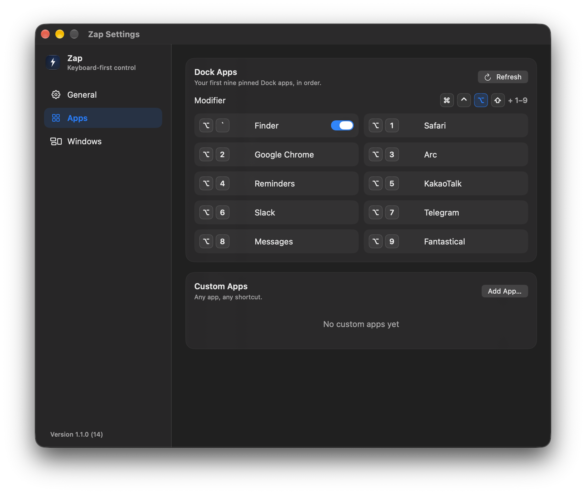
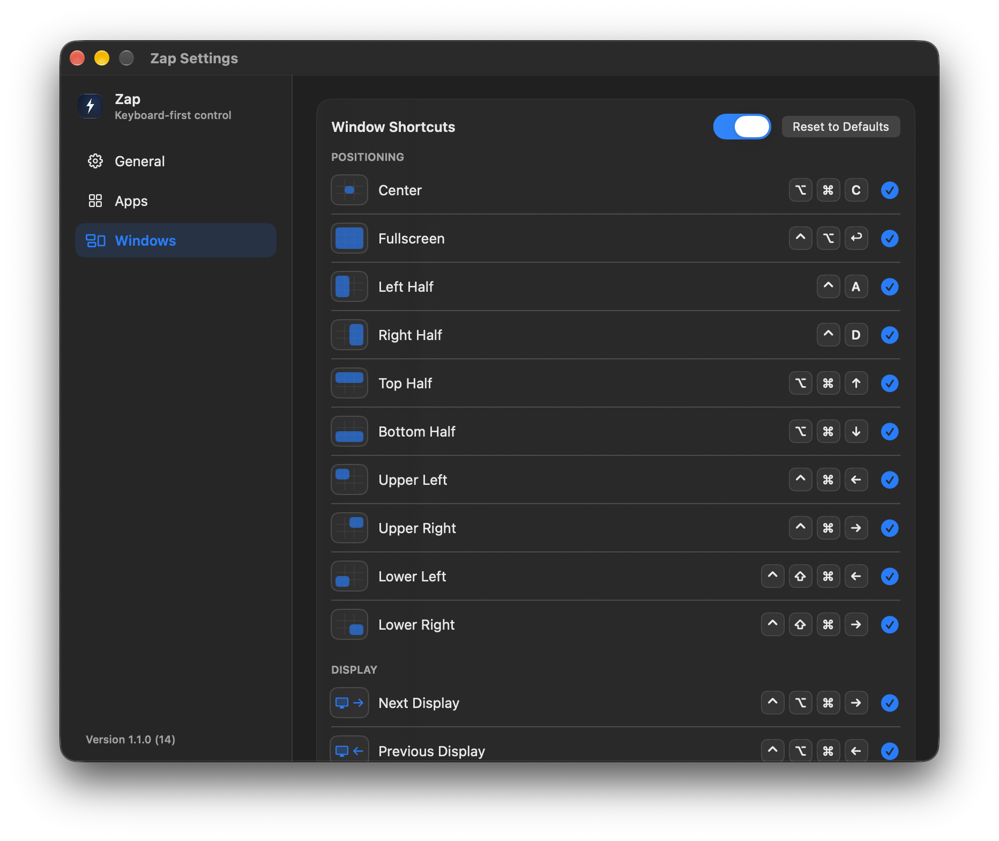

# Zap

**한국어** | [English](README.en.md)

키보드만으로 앱을 열고, 전환하고, 창을 정리하는 macOS 앱입니다.

Dock에 고정한 앱을 `⌥1`~`⌥9`로 바로 열고, 원하는 앱에 나만의 단축키를 붙이고, 지금 보고 있는 창을 마우스 없이 반으로·구석으로·다른 모니터로 옮길 수 있습니다.

  

  

## 설치

1. [최신 릴리스](https://github.com/woosublee/zap/releases/latest)에서 `Zap-<버전>.dmg`를 내려받습니다.
2. DMG를 열고 `Zap.app`을 `응용 프로그램` 폴더로 드래그합니다.
3. Zap을 실행하면 메뉴 막대에 아이콘이 나타납니다.

Zap은 Apple의 공증을 받은 앱이라 경고 없이 바로 열립니다. 새 버전이 나오면 자동으로 알려 줍니다.

macOS 13 Ventura 이상에서 동작합니다.

## 기능

### Dock 앱 단축키

Dock에 고정한 앱 중 앞에서부터 9개가 숫자 키에 자동으로 연결됩니다.

- `⌥1`: Dock의 첫 번째 앱을 열거나 앞으로 가져옵니다.
- `⌥2`: 두 번째 앱. 이렇게 `⌥9`까지 이어집니다.

Dock 순서를 바꾸면 단축키도 그 순서를 따라갑니다. 함께 누를 키는 **설정 > Apps**에서 `⌘` `⌃` `⌥` `⇧` 중 원하는 조합으로 바꿀 수 있습니다.

### 나만의 앱 단축키

Dock에 없는 앱이나 숫자보다 외우기 쉬운 단축키가 필요한 앱은 **설정 > Apps > Custom Apps**에서 직접 추가하세요. 앱마다 원하는 단축키를 지정하고, 언제든 끄거나 바꾸거나 지울 수 있습니다.

### 창 관리

맨 앞에 있는 창을 단축키 하나로 옮기고 크기를 바꿉니다. 기본 단축키는 다음과 같고, **설정 > Windows**에서 하나씩 바꾸거나 끌 수 있습니다.

| 동작 | 기본 단축키 |
| --- | --- |
| 가운데 | `⌥⌘C` |
| 전체 화면 크기 | `⌥⌘F` |
| 왼쪽 / 오른쪽 절반 | `⌥⌘←` / `⌥⌘→` |
| 위 / 아래 절반 | `⌥⌘↑` / `⌥⌘↓` |
| 왼쪽 위 / 오른쪽 위 | `⌃⌘←` / `⌃⌘→` |
| 왼쪽 아래 / 오른쪽 아래 | `⌃⇧⌘←` / `⌃⇧⌘→` |
| 이전 / 다음 3분의 1 | `⌃⌥←` / `⌃⌥→` |
| 작게 / 크게 | `⌃⌥⇧←` / `⌃⌥⇧→` |
| 이전 / 다음 모니터 | `⌃⌥⌘←` / `⌃⌥⌘→` |
| 실행 취소 / 다시 실행 | `⌥⌘Z` / `⌥⇧⌘Z` |

창 관리를 쓰려면 macOS의 **손쉬운 사용** 권한이 필요합니다. 아래 [처음 설정하기](#처음-설정하기)를 참고하세요.

### Finder 단축키

`⌥` + `` ` `` 키로 Finder를 엽니다. 함께 누르는 키는 Dock 앱 단축키 설정을 따릅니다. Dock에서 Finder를 클릭한 것처럼 동작합니다. 한글 입력 상태에서는 같은 자리의 `₩` 키로 표시되지만, 실제 키 위치를 기준으로 하므로 한/영 상태와 상관없이 동작합니다. **설정 > Apps**에서 켜고 끌 수 있습니다.

### 특정 앱에서 Zap 잠시 끄기

Zap 단축키가 다른 앱의 단축키와 겹친다면, **설정 > General**에서 "Toggle Zap for Current App" 단축키를 지정해 두세요. 지금 쓰고 있는 앱에서만 Zap 단축키를 껐다 켤 수 있습니다.

## 처음 설정하기

- **창 관리 권한:** 창 단축키를 쓰려면 **시스템 설정 > 개인정보 보호 및 보안 > 손쉬운 사용**에서 Zap을 허용해야 합니다. 권한이 없으면 **설정 > Windows**에 **Grant…** 버튼이 나타나니 눌러서 허용하세요. Dock 앱 단축키와 나만의 앱 단축키는 권한 없이도 동작합니다.
- **로그인 시 실행:** **설정 > General**에서 켜 두면 Mac을 켤 때 Zap이 자동으로 실행됩니다.

## 메뉴 막대

메뉴 막대 아이콘을 누르면 다음 기능을 바로 쓸 수 있습니다.

- **Quick Launch:** Finder, 나만의 앱, Dock 앱 바로 열기
- **Window Control:** 창 관리 동작 실행
- Dock 앱 목록 새로고침, 업데이트 확인, Zap 정보, 설정, 종료

메뉴 막대 아이콘을 숨기면 Zap은 Dock에 나타나고, Dock 아이콘을 누르면 설정 창이 열립니다.

## 개인정보

Zap은 Mac 안에서만 동작합니다. 서버를 쓰지 않고, 사용 기록을 수집하지 않으며, 앱 목록이나 창 정보, 단축키 설정을 어디에도 보내지 않습니다. 설정은 Mac에만 저장됩니다.

손쉬운 사용 권한은 다른 앱의 창을 옮기고 크기를 바꾸는 데만 쓰입니다.

## 문제 해결

- **창 단축키가 동작하지 않아요.** **시스템 설정 > 개인정보 보호 및 보안 > 손쉬운 사용**에서 Zap이 켜져 있는지 확인하세요. 켜져 있는데도 안 된다면 목록에서 Zap을 지웠다가 다시 추가하세요. Zap 0.1.11 이하에서 업데이트한 경우 이 과정을 한 번 거쳐야 합니다.
- **단축키가 등록되지 않아요.** macOS나 다른 앱이 이미 같은 단축키를 쓰고 있을 수 있습니다. 이 경우 설정 창 위쪽에 오류가 표시되니 다른 단축키로 바꿔 주세요.
- **일부 앱의 창이 원하는 크기로 바뀌지 않아요.** 최소·최대 크기를 정해 둔 앱은 macOS가 허용하는 범위까지만 조절됩니다.

## 개발자용

릴리스 절차는 [docs/RELEASING.md](docs/RELEASING.md)를 참고하세요.
